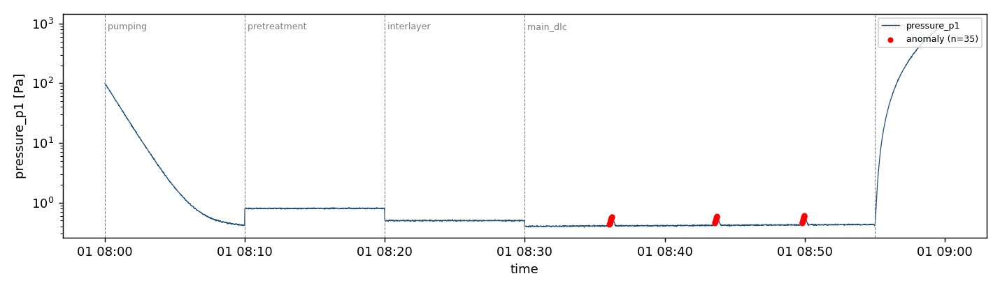

# smart-factory-dlc-anomaly-mvp

> https://github.com/sangjun6122/smart-factory-dlc-anomaly-mvp

DLC(Diamond-Like Carbon) 코팅 공정 센서 로그에 대한 phase-aware 규칙 기반 이상치 탐지 프로토타입. 8시간 이상 소요되는 코팅 batch의 불량이 종료 후 검사에서야 발견되는 문제에 대한 연구의 1단계(설계·프로토타입) 산출물이며, 후속 학습 기반 탐지 연구의 비교 기준(baseline)으로 활용한다. 문제 정의(PRD)부터 구현·검증까지 AI 코딩 도구 기반 워크플로(vibe coding)로 수행하고 전 과정을 기록한다.

| 문서 | 내용 |
|---|---|
| [PRD.md](PRD.md) | 요구사항 정의서 (문제의 본질·기존 한계·해결 방법·검증 계획) |
| [REPORT.md](REPORT.md) | 기술보고서 (사용 매뉴얼·분석 포함) |
| [PROMPTS.md](PROMPTS.md) | 바이브 코딩 실행 전략(3층 설계·에이전트·단계별 프롬프트) + 실행 로그 |
| [CLAUDE.md](CLAUDE.md) / [AGENTS.md](AGENTS.md) | 도구별 상주 컨텍스트 (프로젝트 메모리 / 교차 검토 지침) |

## 개요

공정 센서 로그(CSV)를 phase(펌핑→전처리→중간층→본 증착→벤팅)별로 구분하고, 고정 임계값·이동평균 ±k·σ 규칙으로 이상치를 탐지하여 차트와 이상치 목록을 출력한다. 사내 실데이터는 보안상 사용하지 않으며, 공정 로그의 구조적 특성(폐루프 제어 변수는 안정, 자유응답 변수만 drift)을 모사한 합성 데이터를 사용한다.

## 빠른 시작

**실행 환경**: Python 3.10+ (의존성: pandas, matplotlib, pytest)

```bash
# 1. 설치
pip install -r requirements.txt

# 2. 합성 샘플 데이터 생성 → data/ 에 CSV 4종 + labels.json
python -m src.generate_data

# 3. 이상치 탐지 실행
python -m src.main data/batch_ng_pressure_spike.csv --out results/batch_ng_pressure_spike

# 4. 평가 프로토콜 (칼리브레이션 → 독립 시험 세트)
python -m src.evaluate

# 5. 테스트
python -m pytest tests/ -q
```

**기대 출력**

| 경로 | 내용 |
|---|---|
| `results/<batch>/anomalies.csv` | 이상치 목록 (timestamp, phase, sensor, rule, threshold) |
| `results/<batch>/<sensor>.png` | 센서별 차트 — phase 경계 점선 + 이상점 빨간 마커 |
| `results/calibration.csv` · `evaluation_summary.csv` | k 칼리브레이션 / 시험 세트 집계 |

예시 — 압력 스파이크 batch의 탐지 결과:



상세 매뉴얼은 [REPORT.md 부록 A](REPORT.md) 참조.

## 진행 상태

- [x] 1단계 — 요구사항 정의서, 코드 골격, 보고서 초안, 프롬프트 로그
- [x] 2단계 — 기능 구현, 단위 테스트 3종 통과, 칼리브레이션/시험 분리 평가(시험 세트: 정상 20 batch 오탐 0, 이상 25/25 구간 검출), 결과 분석·보고서 완성
- [ ] 후속 — one-class 학습 모델, inter-batch 컨텍스트, edge 실시간 조기경보

## 연구 질문 (Open Questions)

1. 규칙 기반(±k·σ)은 개별 변수가 정상 범위에 있으면서 변수 간 결합으로만 나타나는 이상을 탐지하지 못한다. 이러한 다변량 패턴을 가장 경량으로 탐지하는 방법은 무엇인가? (Mahalanobis 거리로 충분한가?)
2. 합성 데이터로 검증한 탐지 규칙과 파라미터(k, 윈도)가 실데이터에 일반화되는가? 합성-실데이터 간극을 줄이는 데이터 생성 설계는 무엇인가?
3. phase 라벨이 없는 로그에서 phase 자동 분할 시, 이벤트 기록 기반과 변화점 탐지 기반 중 어느 쪽을 우선해야 하는가?

## AI 도구 사용 명시

설계 문서·코드 골격·문서 초안 작성에 Claude(Cowork)를 사용하였다. 문제 정의·범위 결정·검증은 저자가 수행하였다. 상세는 [PROMPTS.md](PROMPTS.md) 참조.
