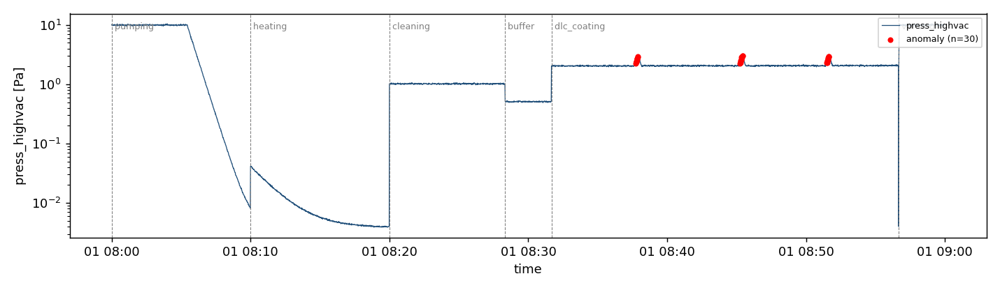
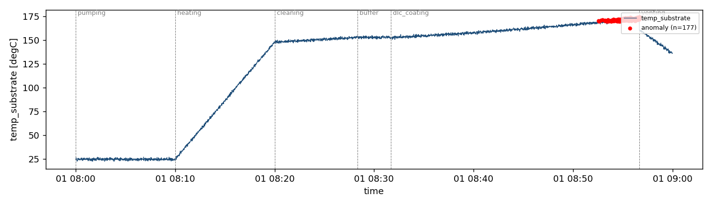
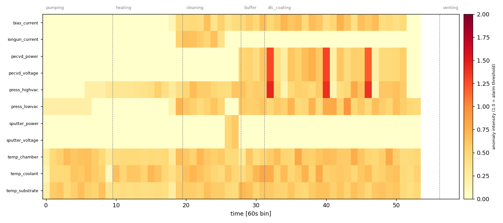

# 기술보고서 — DLC 코팅 공정 센서 데이터 기반 규칙 기반 이상치 탐지 프로토타입

> 작성자: 송상준 (ssj.mlboot@gmail.com) · 2026-06-12
> 1단계(설계) 및 2단계(구현·검증) 완료 시점의 보고서이다.

## 초록

DLC(Diamond-Like Carbon) 코팅은 단일 batch에 8시간 이상이 소요되며, 공정 중 발생한 미세 이상은 batch 종료 후 외관·접착 검사에서 불량(전체의 1~5%)으로 확인되어 큰 손실을 유발한다. 본 연구는 그 첫 단계로, 6단계(펌핑·히팅·클리닝·버퍼·DLC 코팅·벤팅) 공정 로그를 phase별로 구분하고 고정 임계값·이동평균(±k·σ) 규칙으로 이상치를 탐지하여, 채널×시간 이상 강도 히트맵으로 작업자의 공정 계속/중단 판단을 보조하는 프로토타입을 구축한다. 사내 실데이터 대신 실제 장비의 제어 구조(다종 플라즈마 소스·제어/종속/자유응답 변수의 3분류)와 batch 간 자연 편차를 모사한 29채널 합성 데이터를 사용하였다. 칼리브레이션/시험 분리 평가에서 k*=4.5를 산정하고, 독립 시험 세트(정상 20 + 이상 3종×5시드)에서 주입 이상 25/25 구간 검출, 정상 오탐 1건(1/20 batch)을 확인하였다 — 잔여 오탐은 batch 자연 편차 하에서 고정 규칙이 갖는 한계의 정량 실증으로, 학습 기반 후속 연구의 근거가 된다.

## 1. 서론

### 1.1 문제 정의

DLC(Diamond-Like Carbon)는 다이아몬드에 준하는 경도와 낮은 마찰계수를 갖는 탄소 박막으로, 자동차 연료분사 부품·사출금형·정밀공구 등 마모로 수명이 결정되는 부품에 적용된다. PECVD/PVD 기반 DLC 코팅 공정은 진공 챔버 내에서 펌핑(진공 형성)→히팅→클리닝(표면 세정)→버퍼(중간층)→DLC 코팅(본 증착)→벤팅(대기 복귀)의 6단계로 8시간 이상 진행되며, 최종 품질(외관·접착력)은 각 단계 상태의 누적 결과로 결정된다. 장비는 다종 플라즈마 소스(스퍼터·이온건·FCVA·PECVD 등 4~6기)에 복수 가스(10계통 내외)가 조합 공급되고, 복수 히터·기판 바이어스 전원·공자전 턴테이블을 갖추며, 응용 분야에 따라 증착 방법과 레시피가 다양하다. 압력·유량·소스 전기 신호·다위치 온도 등 수십 채널이 1Hz로 기록되지만, 이상의 전조는 단일 변수의 임계치 초과가 아닌 미세한 다변량 패턴으로 나타나며 현재 운영 체계에서는 batch 종료 후 검사 단계에서야 불량이 확인된다. 본 도구의 목적은 자동 판정이 아니라, 조기 경보와 설명 가능한 시각화로 작업자가 공정 계속(pass)/중단(stop)을 올바르게 판단하도록 돕는 것이다.

### 1.2 기존 방법의 한계

현행 운영은 batch 종료 후 검사에 의존하는 사후 확인 체계이다. 단변량 임계치 기반의 통상적 감시는 정상 범위 내 drift를 놓치고, phase 전환에 따른 정상적 거동 변화를 이상으로 오인하며, 변수 간 결합으로만 나타나는 패턴을 다루지 못한다. 폐루프 제어 변수는 제어계가 변동을 흡수하여 정보량이 거의 없으므로 전 채널 동등 감시는 신호를 잡음에 희석시킨다. 나아가 정상 거동 자체가 일정하지 않다 — 공정 중 압력은 펌프 성능, 챔버 오염, 기밀도, 제품 아웃개싱·표면 오염 등으로 batch마다 편차를 가지며, 유지보수 주기에 따라 진공 도달 특성이 서서히 나빠지는 장기 drift도 존재한다. 따라서 진공도·전압·전력 등 단일 수치만 보고 이상 여부를 단순 판단하기 어렵고, 고정 규칙은 이 편차를 수용할 마진만큼 민감도를 잃는다.

### 1.3 연구 목표 및 범위

본 단계의 목표는 "CSV 입력 → phase 구분 → 규칙 기반 이상 탐지 → 이상치 목록·차트 출력"을 수행하는 로컬 도구의 구현이다. 실시간 장비 연동, 학습 기반 모델, 이전 batch 이력 분석은 범위에서 제외하고 후속 연구로 남긴다. 본 규칙 기반 도구는 후속 학습 기반 탐지 연구의 비교 기준(baseline)으로 활용한다.

## 2. 방법

### 2.1 시스템 설계

파이프라인은 입력(load), 처리(detect), 출력(visualize)의 3개 모듈로 분리하였다. 탐지 규칙은 두 가지이다: ① 고정 임계값 — 공정 사양에 근거한 절대 한계, ② 이동평균 ±k·σ — 동일 phase 내 국소 거동 대비 편차. 이동 통계량이 phase 경계를 넘어 계산되면 정상적인 단계 전환을 이상으로 오인하므로, phase별 독립 계산을 설계 원칙으로 하였다.

### 2.2 데이터 설계

사내 실데이터는 보안상 사용하지 않으며, 실제 장비의 제어 구조를 모사한 29채널 합성 데이터를 생성한다(6 phase × 1Hz). 채널 구성: 플라즈마 소스 4기(이온건·스퍼터·PECVD·FCVA, 각 V/I/P), 기판 바이어스 전원(V/I), 히터 2기, 공자전 턴테이블 회전수, MFC 8계통(O₂·He는 장착-미사용 상시 0), 진공 게이지 2종(저진공 0.5 Pa~대기 / 고진공 ~10 Pa), 온도 3점.

핵심 모사 대상은 변수의 **3분류 구조**다. 코팅 시스템은 레시피 기반 자동 시퀀스로 동작하며, 제어 모드의 설정 파라미터(예: 전류 제어 소스의 전류)만 설정값을 추종한다. 같은 소스의 비제어 파라미터(전압·전력)는 챔버 압력(가스량)·타겟 소모·장입물(수량·재질)에 의해 결정되는 **종속 응답 변수**로, 장비·공정 상태 정보를 보유한다.

| 변수군 | 예시 (본 모델) | 변동 특성 | 감시 설계 |
|---|---|---|---|
| ① 제어 | 소스 설정 전류/전압, 바이어스 V, MFC, 히터, 회전수 (18ch) | CV<0.1% 설정값 추종 | 보조: 사양 임계값만 |
| ② 종속 응답 | 전류 제어 소스의 V·P, 이온건 전류, 바이어스 전류 (6ch) | 압력·타겟 소모·장입물에 응답 | 핵심: ±k·σ |
| ③ 자유응답 | 진공 게이지 2종, 온도 3점 (5ch) | 곡선·drift·잡음 | 핵심: ±k·σ |

또한 정상 batch 간 자연 편차(펌핑 시정수·베이스 진공·공정압 레벨·탈가스량·온도 도달치·타겟 소모도)를 무작위 인자로 주입하여, "정상 자체가 일정하지 않다"는 현장 특성을 재현한다. 이상 시나리오 3종(펌핑 지연=누설, 압력 스파이크, 온도 drift 가속)을 주입하며, 압력 스파이크는 전류 제어 물리에 따라 PECVD 전압·전력에도 동반 응답을 만든다. 난수 시드 고정으로 재현성을 보장한다.

### 2.3 평가 프로토콜 — 칼리브레이션/시험 분리

탐지 파라미터(k)가 성능을 보고하는 데이터로 튜닝되면 평가가 낙관적으로 오염된다(데이터 누수). 이를 막기 위해 두 세트를 시드 수준에서 분리하였다: ① **칼리브레이션 세트** — 정상 20 batch(시드 42~61)에서 오탐 0을 만족하는 최소 k를 산정 (k 격자 3.0~5.0, 결과 k*=4.5), ② **시험 세트** — 칼리브레이션에 쓰지 않은 시드의 정상 20 batch(시드 100~119)와 이상 3종×5시드(시드 200~204)로 오탐률과 구간 검출률을 평가. 파라미터 산정에 쓰인 데이터는 성능 보고에 사용하지 않는다. 실행: `python -m src.evaluate`.

### 2.4 개발 방법 — 바이브 코딩 워크플로

본 프로젝트는 도메인 문제 정의부터 구현·검증까지 AI 코딩 도구와의 협업(vibe coding)으로 수행하며, 명세 우선(specification-first) 방식을 적용하였다. 요구사항 정의서(PRD)를 먼저 확정한 뒤 이를 입력으로 코드 골격을 1회 생성하고, 기능 구현은 함수 단위로 분할하여 요청한다. 실패 시 해당 기능만 재요청하여 생성-수정 반복을 최소화한다. 주요 프롬프트와 의사결정은 PROMPTS.md에 기록하여 개발 과정의 추적성을 확보하였다.

## 3. 구현

### 3.1 프로젝트 구조

```
smart-factory-dlc-anomaly-mvp/
├── PRD.md / PRD.pdf        # 요구사항 정의서
├── REPORT.md               # 본 보고서
├── PROMPTS.md              # AI 도구 활용 기록
├── requirements.txt        # pandas, matplotlib, pytest
├── src/
│   ├── load.py             # CSV 파싱·phase 분리 (기능 1)
│   ├── detect.py           # 임계값·이동평균±kσ 탐지 (기능 2)
│   ├── visualize.py        # 차트·이상치 CSV 출력 (기능 3)
│   ├── generate_data.py    # 합성 batch 생성기
│   ├── evaluate.py         # 평가 프로토콜 (칼리브레이션/시험 분리)
│   └── main.py             # CLI 엔트리
├── tests/test_detect.py    # 단위 테스트
├── data/                   # 합성 샘플 CSV 4종 + labels.json
└── results/                # batch별 차트·이상치 CSV·검증 집계
```

### 3.2 핵심 구현

데이터 흐름은 다음 한 줄로 요약된다: `CSV → load(스키마 검증·정렬) → detect(고정 임계값 + phase별 독립 rolling ±k·σ) → visualize(이상치 CSV·차트)`.

핵심은 phase 경계를 넘지 않는 이동 통계량 계산이다. `groupby(["phase","sensor_id"])`로 phase별 독립 계산하여 단계 전환 오경보를 구조적으로 제거하고, 적용 대상을 종속 응답+자유응답 변수 11채널로 한정하여 신호 희석을 방지한다. 또한 게이지 유효 측정 범위(`VALID_RANGE`) 밖의 포화 샘플(저진공 게이지 플로어, 고진공 게이지 상한 클립)은 판정에서 제외한다 — 포화 해제 구간의 곡선 꺾임이 만드는 구조적 오탐을 도메인 지식으로 차단한 것이다.

```python
def detect_rolling_sigma(df, config):
    out = []
    target = df[df["sensor_id"].isin(config.target_sensors)]  # 종속+자유응답 11ch
    for (_ph, _sid), g in target.groupby(["phase", "sensor_id"], observed=True):
        g = g.sort_values("timestamp")
        w = config.rolling_window                  # 기본 120초
        roll = g["value"].rolling(w, min_periods=w)
        mean, std = roll.mean(), roll.std().clip(lower=1e-9)
        hit = g[(g["value"] - mean).abs() > config.k_sigma * std]  # ±k·σ
        ...
```

고정 임계값 규칙은 `{(phase, sensor): (low, high, skip_first_s)}` 사양으로 정의된다. `skip_first_s`는 펌핑 초기처럼 의도적으로 한계를 벗어나는 구간을 판정에서 제외하는 도메인 지식의 반영이다 (예: 펌핑 540초 이후 0.2 Pa 이하 도달 사양).

출력은 바이너리 판정에 그치지 않는다. `anomaly_scores`가 감시 채널별 정규화 이상 강도(1.0=경보 임계)를 산출하고, 이를 **채널×시간 히트맵**(그림 3)으로 시각화한다 — 작업자가 "어느 채널의 어느 시점이 얼마나 이상한가"를 보고 공정 계속/중단을 판단하도록 돕는 설명 장치다.

## 4. 결과

§2.3 프로토콜에 따른 결과다. 칼리브레이션(정상 20 batch)에서 k=4.0은 오탐 7건, k=4.5부터 0건으로 **k\*=4.5를 산정**하였다(`results/calibration.csv`). 시드가 분리된 독립 시험 세트 결과는 표 1과 같다.

표 1. 시험 세트 결과 (칼리브레이션과 시드 분리, k\*=4.5)

| 세트 | batch 수 | 검출 구간 | 오탐 |
|---|---|---|---|
| 시험-정상 (시드 100~119) | 20 | — | **1건 (1/20 batch)** — cleaning 중 temp_chamber 단일점 |
| 시험-이상 펌핑 지연 (시드 200~204) | 5 | 5/5 | 0건 |
| 시험-이상 압력 스파이크 | 5 | 15/15 | 0건 |
| 시험-이상 온도 drift | 5 | 5/5 | 0건 |

주입 이상은 25/25 구간 전부 검출되었고, 정상 20 batch에서 오탐 1건(단일 측정점)이 발생했다 — batch 자연 편차를 포함한 모델에서 고정 규칙이 갖는 한계로, §5에서 논의한다.

대표 사례(데모 batch 4종, 시드 42)의 상세는 표 2와 같다.

표 2. 데모 batch 4종 탐지 결과 (window=120s, k\*=4.5)

| 시나리오 | 주입 이상 | 검출 | 검출 채널 | 첫 경보 (종료 대비) |
|---|---|---|---|---|
| 정상 batch | — | — | — (오탐 0) | — |
| 펌핑 지연 | 누설 모사: 베이스 진공 미달 (플로어 0.005→0.5 Pa) | 1/1 구간 | press_highvac (threshold) | 51분 조기 |
| 압력 스파이크 | DLC 코팅 중 +0.9 Pa 스파이크 3회 | 3/3 구간 | **press_highvac + pecvd_voltage + pecvd_power** (±k·σ) | 22분 조기 |
| 온도 drift | 냉각 이상: 기판 온도 drift 가속 (+12°C) | 1/1 구간 | temp_substrate (threshold) | 7분 조기 |

해석: 펌핑 지연은 "540초 이후 0.2 Pa 이하" 사양 규칙이 위반 즉시 검출했다 — 사후 검사라면 51분 뒤에야 인지했을 이상이다. 압력 스파이크(그림 1)는 절대값으로는 운전 범위(3.0 Pa) 안에 있어 임계값 규칙이 침묵했으나 ±k·σ 규칙이 시험 세트 전체 15/15 구간을 포착했고, **전류 제어 물리에 따라 PECVD 전압·전력(종속 응답 변수)에서도 동시 검출**되었다 — 압력 신호가 없어도 소스 전기 신호만으로 같은 이상을 잡을 수 있음을 시사한다. 온도 drift(그림 2)는 사양 한계(170°C) 초과 시점부터 검출되었다. 히트맵(그림 3)은 세 스파이크가 압력·전압·전력 채널에 동시 기둥으로 나타나는 다변량 신호를 작업자에게 직관적으로 보여준다.

그림 1. 압력 스파이크 batch — DLC 코팅 구간 스파이크 3회 검출 (로그축)



그림 2. 온도 drift batch — 기판 온도 사양 한계(170°C) 초과 구간 검출



그림 3. 압력 스파이크 batch의 채널×시간 이상 강도 히트맵 (1.0 = 경보 임계) — 작업자 pass/stop 판단 보조



재현성: 동일 시드에 대해 동일 출력이 나옴을 단위 테스트로 확인하였다(테스트 3종 통과). 집계 파일: `results/calibration.csv`(칼리브레이션), `results/evaluation_summary.csv`(시험 세트), `results/verification_summary.csv`(데모 4종).

## 5. 고찰

**잘된 점.** 독립 시험 세트의 정상 20 batch — 누적 phase 전환 120회, 펌핑 고압·게이지 포화 구간 다수 — 에서 구조적 오경보가 발생하지 않았다(잔여 1건은 잡음 단일점). phase별 독립 계산, `skip_first_s` 사양, 게이지 유효 범위(`VALID_RANGE`) 제외라는 세 가지 도메인 규칙의 직접적 효과로, PRD에서 진단한 한계 ②(단계 전환 오경보)가 해소되었음을 보여준다. 특히 게이지 유효 범위 규칙은 개발 중 실제로 발견된 구조적 오탐(고진공 게이지 포화 해제 구간의 곡선 꺾임 — k=6에서도 오탐 9건 잔존)을 도메인 지식으로 차단한 사례다.

**평가 방법론의 교정.** 초기 검증은 정상 1개 batch로 k=4를 정하고 같은 batch로 오탐 0을 보고했다 — 파라미터 산정과 성능 보고가 같은 데이터를 쓰는 전형적 누수였고, 실제로 정상 batch를 20개로 늘리자 k=4에서 오탐 6건이 드러났다. 칼리브레이션/시험 세트 분리(§2.3)로 교정한 뒤에야 "오탐 0"이 통계적으로 방어 가능한 주장(시험 세트 정상 20 batch, 오탐 발생 batch 0/20)이 되었다.

**규칙 기반의 한계 실증 — 세 가지.** ① 시험 세트 정상 오탐 1건: batch 자연 편차(펌프 성능·오염·기밀·아웃개싱)를 포함한 모델에서는 어떤 고정 k로도 오탐 0과 민감도를 동시에 보장할 수 없다 — 이 1건/20 batch가 규칙 기반 baseline의 측정된 오탐률이며, 후속 학습 모델이 이겨야 할 기준선이다. ② 온도 drift 시나리오에서 ±k·σ 규칙은 침묵하고 임계값 규칙만 검출했다 — 이동평균이 완만한 drift를 추종하기 때문으로, 사양 한계가 없는 변수의 점진적 drift는 본 도구가 놓칠 수 있다(PRD 한계 ①의 부분 해소). ③ 개별 변수는 정상이면서 변수 간 결합으로만 드러나는 패턴(한계 ③)과, 유지보수 주기에 따른 장기 컨디션 drift(정상 기준 자체의 이동)는 단일 batch 규칙으로 원리상 다루지 못한다. 세 한계 모두 최근 정상 batch들의 참조 프로파일(golden batch 밴드)과 비교하는 inter-batch 분석 및 전역 정상 분포를 학습하는 one-class 모델(후속 연구)의 필요성에 대한 실증적 근거다.

**개발 방법 회고.** 명세(PRD) 우선으로 골격을 1회 생성한 뒤 함수 단위로 구현한 결과, 전체 재생성 없이 단건 수정 2회(빈 DataFrame concat 경고 처리, ground-truth 라벨 정의 정정)와 평가 프로토콜 교정 1회(칼리브레이션/시험 분리)로 구현·검증이 완료되었다. AI 도구는 구현 속도에 기여했으나, 이상 시나리오의 물리적 타당성과 ground-truth 정의 같은 도메인 판단은 사람의 역할로 남았다 — 특히 "냉각 이상은 phase 시작부터 존재하는 결함"이라는 라벨 정의 수정은 도구가 아닌 도메인 지식에서 나왔다.

**의미.** 1시간 축소 모형에서 7~51분 조기 인지는, 비율을 유지한 실제 8시간 공정으로 환산하면 약 1~7시간의 조기 경보에 해당한다. 본 도구의 판단 주체는 작업자다 — 바이너리 경보가 아닌 채널×시간 이상 강도 히트맵으로 "어디가 왜 이상한가"를 제시함으로써, 작업자가 공정 계속/중단을 판단할 근거를 제공한다. 종속 응답 변수(소스 전압·전력)에서의 동시 검출은 향후 다변량 접근의 잠재력을 보여준다.

## 6. 결론 및 향후 연구

본 프로토타입은 DLC 공정 로그에 대한 phase-aware 규칙 기반 이상 탐지 baseline(측정 오탐률 1건/20 batch, 이상 검출 25/25)과 작업자 판단 보조용 히트맵을 제공한다. 향후 연구는 다음 세 방향으로 진행한다: ① 최근 정상 batch들의 phase별 참조 프로파일(golden batch 밴드)과 현재 batch를 대조하는 inter-batch 비교 — 공정 초반은 이전과 일치하나 중반부터 벌어지는 패턴의 식별, 유지보수 주기 장기 drift의 반영, ② 정상 데이터 기반(one-class) 학습 모델로 다변량 결합 패턴 탐지, ③ edge 디바이스 실시간 추론·경보(latching) 체계. 이는 진행 중인 실시간 조기경보 시스템 연구로 연결된다.

## 부록 A. 사용 매뉴얼

```bash
# 1. 환경 설치 (Python 3.10+)
pip install -r requirements.txt

# 2. 합성 샘플 데이터 생성 (data/ 폴더에 4종 + labels.json)
python -m src.generate_data

# 3. 이상치 탐지 실행
python -m src.main data/batch_ng_pressure_spike.csv --out results/batch_ng_pressure_spike
#   --window 120  롤링 윈도(초, 기본값)
#   --k 4.5       k·σ 배수(기본값 — 칼리브레이션 산정값)

# 3-1. 평가 프로토콜 실행 (칼리브레이션 → 독립 시험 세트)
python -m src.evaluate

# 4. 결과 확인
#   results/<batch>/anomalies.csv    이상치 목록
#   results/<batch>/<sensor_id>.png  센서별 차트 (phase 경계·이상점 표시)
#   results/<batch>/heatmap.png      채널×시간 이상 강도 히트맵
#   results/verification_summary.csv 4종 batch 검증 집계

# 5. 테스트
python -m pytest tests/
```

## 부록 B. AI 도구 사용 명시 및 데이터 윤리

**본 프로젝트의 모든 코드(소스 6모듈·단위 테스트·평가 스크립트)는 AI 코딩 도구가 생성하였으며, 저자는 코드를 한 줄도 직접 작성하지 않았다.** 저자의 역할은 문제 정의, 명세(PRD) 작성·확정, 산출물 리뷰, 도메인 판단, 검증 판정에 한정된다 — 이는 'AI 코딩 도구만으로 프로젝트를 수행한다'는 본 프로젝트의 수행 원칙에 따른 것이다. 도구는 Claude(Cowork/Claude Code) 중심이며, Codex 교차 검증 프로세스는 설계 완료 상태로 제출 전 점검·후속 단계에 적용 예정이다. 항목별 수행 주체는 다음과 같다.

| 항목 | 수행 주체 |
|---|---|
| 주제 선정·현장 문제 정의 | 본인 |
| 도메인 통찰(정보 비대칭)·이상 시나리오 수치 | 본인 |
| PRD 작성·논리 구조 | 본인 + Claude (본인 검토·확정) |
| 코드 골격·구현 코드 생성 | Claude (명세는 본인) |
| 코드 검토·파라미터 확정(k=4.5) | 본인 |
| ground-truth 정의·평가 방법론(누수 교정) | 본인 |
| 검증 실행·집계 | Claude (판정은 본인) |
| 결과 해석·고찰 | 본인 + Claude 초안 (사실 확인 본인) |

프롬프트 기록은 PROMPTS.md를 참조한다. 사내 실데이터 및 고객 정보는 포함하지 않았다.
