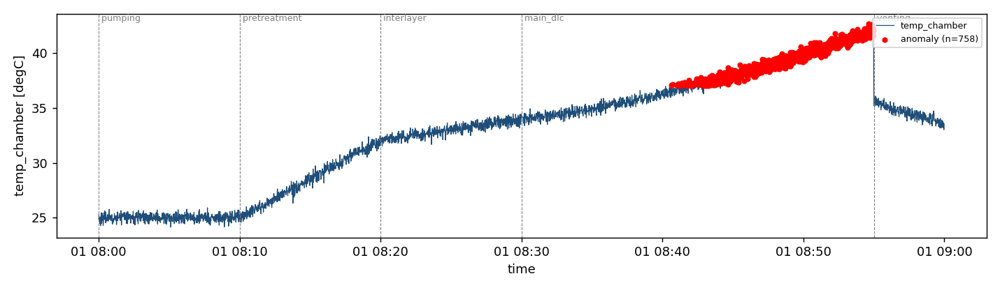

# 기술보고서 — DLC 코팅 공정 센서 데이터 기반 규칙 기반 이상치 탐지 프로토타입

> 작성자: 송상준 (ssj.mlboot@gmail.com) · 2026-06-12
> 1단계(설계) 및 2단계(구현·검증) 완료 시점의 보고서이다.

## 초록

DLC(Diamond-Like Carbon) 코팅은 단일 batch에 8시간 이상이 소요되며, 공정 중 발생한 미세 이상은 batch 종료 후 외관·접착 검사에서 불량(전체의 1~5%)으로 확인되어 큰 손실을 유발한다. 본 연구는 그 첫 단계로, multi-phase 공정 센서 로그를 phase별로 구분하고 고정 임계값·이동평균(±k·σ) 규칙으로 이상치를 탐지하여 시각화하는 프로토타입을 구축한다. 사내 실데이터 대신 공정 구조를 모사한 합성 데이터를 사용하여 재현성을 확보하였다. 평가는 칼리브레이션/시험 세트 분리 프로토콜을 따랐다: 정상 20 batch 칼리브레이션에서 k*=4.5를 산정하고, 시드가 분리된 독립 시험 세트(정상 20 + 이상 3종×5시드)에서 주입 이상 25/25 구간 검출, 오탐 0건을 확인하였다. 첫 경보는 batch 종료 후 검사 대비 19~53분(1시간 축소 모형 기준) 조기였다.

## 1. 서론

### 1.1 문제 정의

DLC(Diamond-Like Carbon)는 다이아몬드에 준하는 경도와 낮은 마찰계수를 갖는 탄소 박막으로, 자동차 연료분사 부품·사출금형·정밀공구 등 마모로 수명이 결정되는 부품에 적용된다. PVD 기반 DLC 코팅 공정은 진공 챔버 내에서 펌핑(진공 형성), 전처리(표면 세정), 중간층 증착(접착층), 본 증착, 벤팅(대기 복귀)의 다단계로 8시간 이상 진행되며, 최종 품질(외관·접착력)은 각 단계 상태의 누적 결과로 결정된다. 펌핑 단계의 진공 누설, 챔버·제품 오염과 같은 이상의 전조는 단일 변수의 임계치 초과가 아닌 미세한 다변량 패턴으로 나타나며, 현재 운영 체계에서는 batch 종료 후 검사 단계에서야 불량이 확인된다. 50채널 이상의 로그를 운영자가 상시 감시하는 것은 비현실적이므로, 공정 로그를 자동 분석하는 도구가 필요하다.

### 1.2 기존 방법의 한계

현행 운영은 batch 종료 후 검사에 의존하는 사후 확인 체계이다. 단변량 임계치 기반의 통상적 감시는 정상 범위 내 drift를 놓치고, phase 전환에 따른 정상적 거동 변화를 이상으로 오인하며, 변수 간 결합으로만 나타나는 패턴을 다루지 못한다. 또한 폐루프 제어 변수는 제어계가 변동을 흡수하여 정보량이 거의 없으므로, 전 채널을 동등하게 감시하는 방식은 신호를 잡음에 희석시킨다.

### 1.3 연구 목표 및 범위

본 단계의 목표는 "CSV 입력 → phase 구분 → 규칙 기반 이상 탐지 → 이상치 목록·차트 출력"을 수행하는 로컬 도구의 구현이다. 실시간 장비 연동, 학습 기반 모델, 이전 batch 이력 분석은 범위에서 제외하고 후속 연구로 남긴다. 본 규칙 기반 도구는 후속 학습 기반 탐지 연구의 비교 기준(baseline)으로 활용한다.

## 2. 방법

### 2.1 시스템 설계

파이프라인은 입력(load), 처리(detect), 출력(visualize)의 3개 모듈로 분리하였다. 탐지 규칙은 두 가지이다: ① 고정 임계값 — 공정 사양에 근거한 절대 한계, ② 이동평균 ±k·σ — 동일 phase 내 국소 거동 대비 편차. 이동 통계량이 phase 경계를 넘어 계산되면 정상적인 단계 전환을 이상으로 오인하므로, phase별 독립 계산을 설계 원칙으로 하였다.

### 2.2 데이터 설계

사내 실데이터는 보안상 사용하지 않으며, 실제 공정 로그의 구조적 특성만 모사한 합성 데이터를 생성한다. 핵심 모사 대상은 변수의 이원적 구조이다. 폐루프 제어 변수(전류·전압·가스유량)는 변동계수(CV) 0.1% 미만으로 안정한 반면, 자유응답 변수(챔버 압력·온도)는 수 % 수준의 변동과 drift를 보인다. 따라서 이상 신호가 주로 자유응답 변수에 나타나도록 이상 시나리오 3종(펌핑 지연, 압력 스파이크, 온도 drift 가속)을 주입한다. 난수 시드를 고정하여 동일 입력에 대한 동일 출력을 보장한다.

변수군별 특성과 감시 설계의 대응은 다음과 같다. 이 분석이 자유응답 변수 중심 감시 설계의 근거이다.

| 변수군 | 예시 | 변동 특성 | 이상 정보량 | 감시 설계 |
|---|---|---|---|---|
| 폐루프 제어 | 전류·전압·가스유량 | CV 0.1% 미만, 설정값 추종 | 낮음 — 제어기가 변동 흡수 | 보조: 고정 임계값만 적용 |
| 자유응답 | 챔버 압력·온도 | CV 수 %, drift 존재 | 높음 — 시스템 응답 반영 | 핵심: 이동평균 ±k·σ 적용 |

### 2.3 평가 프로토콜 — 칼리브레이션/시험 분리

탐지 파라미터(k)가 성능을 보고하는 데이터로 튜닝되면 평가가 낙관적으로 오염된다(데이터 누수). 이를 막기 위해 두 세트를 시드 수준에서 분리하였다: ① **칼리브레이션 세트** — 정상 20 batch(시드 42~61)에서 오탐 0을 만족하는 최소 k를 산정 (k 격자 3.0~5.0, 결과 k*=4.5), ② **시험 세트** — 칼리브레이션에 쓰지 않은 시드의 정상 20 batch(시드 100~119)와 이상 3종×5시드(시드 200~204)로 오탐률과 구간 검출률을 평가. 파라미터 산정에 쓰인 데이터는 성능 보고에 사용하지 않는다. 실행: `python -m src.evaluate`.

### 2.4 개발 방법 — 바이브 코딩 워크플로

본 프로젝트는 도메인 문제 정의부터 구현·검증까지 AI 코딩 도구와의 협업(vibe coding)으로 수행하며, 명세 우선(specification-first) 방식을 적용하였다. 요구사항 정의서(PRD)를 먼저 확정한 뒤 이를 입력으로 코드 골격을 1회 생성하고, 기능 구현은 함수 단위로 분할하여 요청한다. 실패 시 해당 기능만 재요청하여 생성-수정 반복을 최소화한다. 주요 프롬프트와 의사결정은 PROMPTS.md에 기록하여 개발 과정의 추적성을 확보하였다.

## 3. 구현

### 3.1 프로젝트 구조

```
smart-factory-dlc-anomaly-mvp/
├── PRD.md / PRD.pdf        # 요구사항 정의서
├── REPORT.md               # 본 보고서
├── PROMPTS.md              # AI 도구 활용 기록
├── requirements.txt        # pandas, matplotlib, pytest
├── src/
│   ├── load.py             # CSV 파싱·phase 분리 (기능 1)
│   ├── detect.py           # 임계값·이동평균±kσ 탐지 (기능 2)
│   ├── visualize.py        # 차트·이상치 CSV 출력 (기능 3)
│   ├── generate_data.py    # 합성 batch 생성기
│   ├── evaluate.py         # 평가 프로토콜 (칼리브레이션/시험 분리)
│   └── main.py             # CLI 엔트리
├── tests/test_detect.py    # 단위 테스트
├── data/                   # 합성 샘플 CSV 4종 + labels.json
└── results/                # batch별 차트·이상치 CSV·검증 집계
```

### 3.2 핵심 구현

데이터 흐름은 다음 한 줄로 요약된다: `CSV → load(스키마 검증·정렬) → detect(고정 임계값 + phase별 독립 rolling ±k·σ) → visualize(이상치 CSV·차트)`.

핵심은 phase 경계를 넘지 않는 이동 통계량 계산이다. `groupby(["phase","sensor_id"])`로 phase별 독립 계산하여 단계 전환 오경보를 구조적으로 제거하고, 적용 대상을 자유응답 변수로 한정하여 신호 희석을 방지한다.

```python
def detect_rolling_sigma(df, config):
    out = []
    target = df[df["sensor_id"].isin(config.target_sensors)]  # 자유응답 변수만
    for (_ph, _sid), g in target.groupby(["phase", "sensor_id"], observed=True):
        g = g.sort_values("timestamp")
        w = config.rolling_window                  # 기본 120초
        roll = g["value"].rolling(w, min_periods=w)
        mean, std = roll.mean(), roll.std().clip(lower=1e-9)
        hit = g[(g["value"] - mean).abs() > config.k_sigma * std]  # ±k·σ
        ...
```

고정 임계값 규칙은 `{(phase, sensor): (low, high, skip_first_s)}` 사양으로 정의된다. `skip_first_s`는 펌핑 초기처럼 의도적으로 한계를 벗어나는 구간을 판정에서 제외하는 도메인 지식의 반영이다 (예: 펌핑 시작 420초 이후 압력 2.0 Pa 이하 도달 사양).

## 4. 결과

§2.3 프로토콜에 따른 결과다. 칼리브레이션(정상 20 batch)에서 k=4.0은 오탐 6건, k=4.5부터 0건으로 **k\*=4.5를 산정**하였다(`results/calibration.csv`). 시드가 분리된 독립 시험 세트 결과는 표 2와 같다 — 정상 20 batch에서 오탐 0건, 이상 3종×5시드에서 주입 구간 25/25 검출, 구간 외 오탐 0건.

표 2. 시험 세트 결과 (칼리브레이션과 시드 분리, k\*=4.5)

| 세트 | batch 수 | 검출 구간 | 오탐 |
|---|---|---|---|
| 시험-정상 (시드 100~119) | 20 | — | 0건 (오탐 발생 batch 0/20) |
| 시험-이상 펌핑 지연 (시드 200~204) | 5 | 5/5 | 0건 |
| 시험-이상 압력 스파이크 | 5 | 15/15 | 0건 |
| 시험-이상 온도 drift | 5 | 5/5 | 0건 |

대표 사례 분석을 위한 데모 batch 4종(시드 42)의 상세 결과는 표 1과 같다.

표 1. 데모 batch 4종 탐지 결과 (window=120s, k*=4.5)

| 시나리오 | 주입 이상 | 검출 | 탐지 규칙 | 오탐 | 첫 경보 (batch 종료 대비) |
|---|---|---|---|---|---|
| 정상 batch | — | — | — | 0건 | — |
| 펌핑 지연 | 누설 모사: 베이스 진공 미달 (플로어 0.4→4 Pa) | 1/1 구간 | threshold | 0건 | 53분 조기 |
| 압력 스파이크 | main_dlc 중 압력 스파이크 3회 (+0.18 Pa) | 3/3 구간 | rolling ±k·σ | 0건 | 24분 조기 |
| 온도 drift | 냉각 이상 모사: 온도 drift 가속 (+6.5°C) | 1/1 구간 | threshold | 0건 | 19분 조기 |

각 결과의 해석은 다음과 같다. 펌핑 지연은 "420초 이후 2.0 Pa 이하" 사양 규칙이 위반 시점부터 즉시(지연 0초) 검출하였다 — 사후 검사라면 53분 뒤에야 인지했을 이상이다. 압력 스파이크(그림 1)는 절대값으로는 운전 범위(0.7 Pa) 안에 있어 임계값 규칙이 침묵했으나, phase 국소 거동 대비 편차를 보는 rolling ±k·σ 규칙이 시험 세트 전체에서 15/15 구간을 포착하였다 — PRD 진단 ①(정상 범위 내 이상)에 대한 설계 대응이 작동함을 보여준다. 온도 drift(그림 2)는 사양 한계(37°C) 초과 시점부터 검출되었다.

그림 1. 압력 스파이크 batch — main_dlc 구간의 스파이크 3회 검출 (로그축)


그림 2. 온도 drift batch — 사양 한계(37°C) 초과 구간 검출



재현성: 동일 시드에 대해 동일 출력이 나옴을 단위 테스트로 확인하였다(테스트 3종 통과). 집계 파일: `results/calibration.csv`(칼리브레이션), `results/evaluation_summary.csv`(시험 세트), `results/verification_summary.csv`(데모 4종).

## 5. 고찰

**잘된 점.** 독립 시험 세트의 정상 20 batch(누적 phase 전환 100회, 펌핑 고압 구간 20회)에서 오경보가 전혀 발생하지 않은 것은 phase별 독립 계산과 `skip_first_s` 사양 설계의 직접적 효과로, PRD에서 진단한 한계 ②(단계 전환 오경보)가 해소되었음을 보여준다.

**평가 방법론의 교정.** 초기 검증은 정상 1개 batch로 k=4를 정하고 같은 batch로 오탐 0을 보고했다 — 파라미터 산정과 성능 보고가 같은 데이터를 쓰는 전형적 누수였고, 실제로 정상 batch를 20개로 늘리자 k=4에서 오탐 6건이 드러났다. 칼리브레이션/시험 세트 분리(§2.3)로 교정한 뒤에야 "오탐 0"이 통계적으로 방어 가능한 주장(시험 세트 정상 20 batch, 오탐 발생 batch 0/20)이 되었다.

**규칙 기반의 한계 실증.** 온도 drift 시나리오에서 rolling ±k·σ 규칙은 침묵하고 고정 임계값 규칙만 검출에 성공했다. 이동평균이 완만한 drift를 추종해 버리기 때문이다(윈도 120초 동안 변화량 약 0.4°C로 k·σ 폭 약 1.4°C에 미달). 즉 사양 한계가 정의되지 않은 변수에서 진행되는 점진적 drift는 본 도구가 놓칠 수 있으며, 이는 PRD 한계 ①이 부분적으로만 해소됨을 정량적으로 확인한 것이다. 개별 변수가 모두 정상 범위에 있으면서 변수 간 결합으로만 드러나는 패턴(한계 ③)도 원리상 다루지 못한다. 두 한계 모두 전역 정상 분포를 학습하는 후속 연구(one-class 모델)의 필요성에 대한 실증적 근거가 된다.

**개발 방법 회고.** 명세(PRD) 우선으로 골격을 1회 생성한 뒤 함수 단위로 구현한 결과, 전체 재생성 없이 단건 수정 2회(빈 DataFrame concat 경고 처리, ground-truth 라벨 정의 정정)와 평가 프로토콜 교정 1회(칼리브레이션/시험 분리)로 구현·검증이 완료되었다. AI 도구는 구현 속도에 기여했으나, 이상 시나리오의 물리적 타당성과 ground-truth 정의 같은 도메인 판단은 사람의 역할로 남았다 — 특히 "냉각 이상은 phase 시작부터 존재하는 결함"이라는 라벨 정의 수정은 도구가 아닌 도메인 지식에서 나왔다.

**의미.** 1시간 축소 모형에서 19~53분 조기 인지는, 비율을 유지한 실제 8시간 공정으로 환산하면 수 시간 단위의 조기 경보에 해당한다. 사후 검사 대비 운영자가 개입할 수 있는 시간 여유를 만든다는 점에서, 규칙 기반 baseline만으로도 현장 가치가 있음을 시사한다.

## 6. 결론 및 향후 연구

본 프로토타입은 DLC 공정 로그에 대한 phase-aware 규칙 기반 이상 탐지 baseline을 제공한다. 향후 연구는 다음 세 방향으로 진행한다: ① 정상 데이터 기반(one-class) 학습 모델을 통한 다변량 미세 패턴 탐지, ② 이전 batch 이력(inter-batch) 컨텍스트의 반영, ③ edge 디바이스 기반 실시간 추론 및 경보(latching) 체계. 이는 진행 중인 실시간 조기경보 시스템 연구로 연결된다.

## 부록 A. 사용 매뉴얼

```bash
# 1. 환경 설치 (Python 3.10+)
pip install -r requirements.txt

# 2. 합성 샘플 데이터 생성 (data/ 폴더에 4종 + labels.json)
python -m src.generate_data

# 3. 이상치 탐지 실행
python -m src.main data/batch_ng_pressure_spike.csv --out results/batch_ng_pressure_spike
#   --window 120  롤링 윈도(초, 기본값)
#   --k 4.5       k·σ 배수(기본값 — 칼리브레이션 산정값)

# 3-1. 평가 프로토콜 실행 (칼리브레이션 → 독립 시험 세트)
python -m src.evaluate

# 4. 결과 확인
#   results/<batch>/anomalies.csv    이상치 목록
#   results/<batch>/<sensor_id>.png  센서별 차트 (phase 경계·이상점 표시)
#   results/verification_summary.csv 4종 batch 검증 집계

# 5. 테스트
python -m pytest tests/
```

## 부록 B. AI 도구 사용 명시 및 데이터 윤리

요구사항 정의서, 코드 골격, 문서 초안 작성에 LLM 기반 도구(Claude)를 사용하였다. 주제 선정, 문제 정의, 공정 도메인 사실관계 확인, 최종 검증은 저자가 수행하였다. 프롬프트 기록은 PROMPTS.md를 참조한다. 사내 실데이터 및 고객 정보는 포함하지 않았다.
